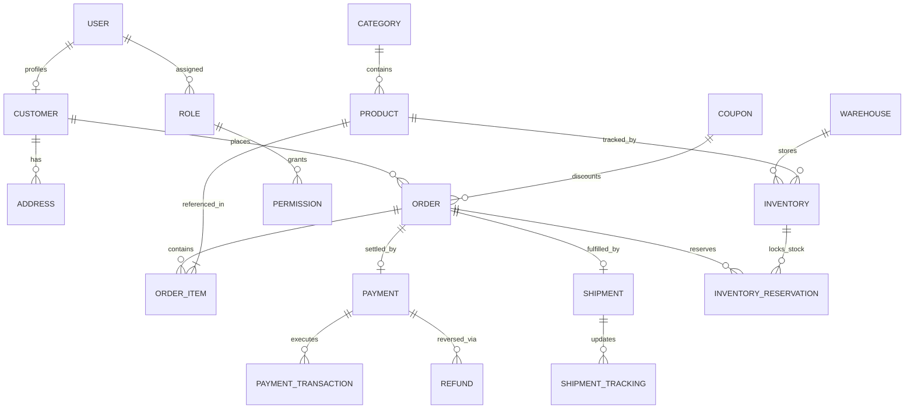

# EOPIS — Enterprise Order, Payment & Inventory System
## Architecture Design Document (Phase 1)

---

### 1. System Overview

**EOPIS (Enterprise Order, Payment & Inventory System)** is an enterprise-grade modular monolith built on Java 21+ and Spring Boot 3.x. It is engineered to simulate a live, highly-concurrent production e-commerce backend while serving as a real-time debugging laboratory.

The application starts as a modular monolith running against a containerized infrastructure (PostgreSQL, Redis, Kafka, Observability Stack) and is progressively enhanced with toggleable chaos mechanisms for advanced failure investigation.

```
                          ┌─────────────────────────┐
                          │   IntelliJ IDEA         │
                          │  attaches debugger      │
                          └────────────┬─────────────┘
                                       │ (JDWP 5005)
                                       ↓
    docker-compose.yml (Local Production-like Stack):
    ┌──────────────────────────────────────────────────────────────┐
    │  eopis-app (Spring Boot 3.x, JVM Debug exposed)              │
    │       │                    │                    │            │
    │       ▼                    ▼                    ▼            │
    │  PostgreSQL 16        Redis 7.x           Kafka + Broker     │
    │  (+ pgAdmin 4)       (Cache, Lock)       (+ Kafka-UI)        │
    │       │                                                      │
    │       ▼                                                      │
    │  Prometheus + Grafana (Live Metrics & Dashboards)            │
    │       │                                                      │
    │       ▼                                                      │
    │  Structured JSON Logs (MDC Request/Correlation IDs)          │
    └──────────────────────────────────────────────────────────────┘
```

---

### 2. Package & Module Architecture

The codebase strictly follows a **domain-modular monolith** design under the `com.eopis` root package to prevent architectural drift and circular dependencies:

```text
com.eopis
├── EopisApplication.java
│
├── common
│   ├── config/              # SecurityConfig, RedisConfig, KafkaConfig, WebMvcConfig
│   ├── exception/           # GlobalExceptionHandler, BusinessException, ResourceNotFoundException
│   ├── logging/             # CorrelationIdFilter, RequestLoggingInterceptor, MaskingJsonLayout
│   ├── security/            # JwtTokenProvider, JwtAuthFilter, SecurityContextUtils
│   ├── chaos/               # ChaosProperties, ChaosAspect, FaultInjector, ChaosEndpoint
│   └── util/                # DateTimeUtils, MoneyUtils, IdGenerator
│
├── customer
│   ├── controller/          # CustomerController, AddressController
│   ├── service/             # CustomerService, CustomerServiceImpl
│   ├── repository/          # CustomerRepository, AddressRepository
│   ├── entity/              # Customer, Address
│   └── dto/                 # CustomerRequest, CustomerResponse, AddressDto
│
├── product
│   ├── controller/          # ProductController, CategoryController
│   ├── service/             # ProductService, CategoryService
│   ├── repository/          # ProductRepository, CategoryRepository
│   ├── entity/              # Product, Category
│   └── dto/                 # ProductRequest, ProductResponse, CategoryDto
│
├── inventory
│   ├── controller/          # InventoryController, WarehouseController
│   ├── service/             # InventoryService, ReservationService
│   ├── repository/          # InventoryRepository, WarehouseRepository, ReservationRepository
│   ├── entity/              # Inventory, Warehouse, InventoryReservation
│   └── dto/                 # StockUpdateRequest, ReservationRequest, InventoryDto
│
├── order
│   ├── controller/          # OrderController, CouponController
│   ├── service/             # OrderService, OrderPlacementCoordinator, CouponService
│   ├── repository/          # OrderRepository, OrderItemRepository, CouponRepository
│   ├── entity/              # Order, OrderItem, Coupon, Promotion
│   └── dto/                 # OrderCreateRequest, OrderResponse, OrderItemDto
│
├── payment
│   ├── controller/          # PaymentController, RefundController
│   ├── service/             # PaymentService, PaymentGatewayClient, RefundService
│   ├── repository/          # PaymentRepository, PaymentTransactionRepository, RefundRepository
│   ├── entity/              # Payment, PaymentTransaction, Refund
│   └── dto/                 # PaymentRequest, PaymentResponse, RefundRequest
│
├── shipment
│   ├── controller/          # ShipmentController
│   ├── service/             # ShipmentService, TrackingService
│   ├── repository/          # ShipmentRepository, ShipmentTrackingRepository
│   ├── entity/              # Shipment, ShipmentTracking
│   └── dto/                 # ShipmentRequest, TrackingUpdateDto
│
├── notification
│   ├── consumer/            # NotificationKafkaConsumer
│   ├── service/             # NotificationService, EmailSender
│   ├── repository/          # NotificationLogRepository
│   └── entity/              # NotificationLog
│
├── audit
│   ├── aspect/              # AuditLogAspect
│   ├── service/             # AuditService
│   ├── repository/          # AuditLogRepository
│   └── entity/              # AuditLog
│
└── security
    ├── controller/          # AuthController, UserController
    ├── service/             # UserService, AuthService, CustomUserDetailsService
    ├── repository/          # UserRepository, RoleRepository, PermissionRepository
    ├── entity/              # User, Role, Permission
    └── dto/                 # AuthRequest, AuthResponse, RegisterRequest
```

---

### 3. Domain Entity Relational Model



#### Core Entities & Attributes:

1. **`User` & `Customer`**:
   - `User`: `id (UUID)`, `username`, `email`, `password_hash`, `status`, `created_at`, `updated_at`, `version (Long)`.
   - `Role`, `Permission`: Standard RBAC join tables (`users_roles`, `roles_permissions`).
   - `Customer`: `id (Long)`, `user_id (UUID, FK)`, `customer_number (VARCHAR - e.g. CUST-18291)`, `first_name`, `last_name`, `phone`, `tier (REGULAR, VIP, ENTERPRISE)`.
   - `Address`: `id (Long)`, `customer_id (FK)`, `street`, `city`, `state`, `postal_code`, `country`, `is_default_billing`, `is_default_shipping`.

2. **`Product` & `Category`**:
   - `Category`: `id (Long)`, `name`, `code`, `parent_id (Self FK for hierarchical categories)`.
   - `Product`: `id (Long)`, `sku (VARCHAR - e.g. PROD-381)`, `name`, `description`, `price (Numeric(12,2))`, `currency`, `category_id (FK)`, `status (ACTIVE, DISCONTINUED, DRAFT)`, `version (Long)`.

3. **`Warehouse` & `Inventory`**:
   - `Warehouse`: `id (Long)`, `code (e.g. WH-17)`, `name`, `location_address`, `is_active`.
   - `Inventory`: `id (Long)`, `warehouse_id (FK)`, `product_id (FK)`, `quantity_available (Int)`, `quantity_allocated (Int)`, `reorder_threshold (Int)`, `version (Long)`.
   - `InventoryReservation`: `id (UUID)`, `order_id (FK)`, `inventory_id (FK)`, `quantity (Int)`, `status (PENDING, CONFIRMED, RELEASED, EXPIRED)`, `expires_at (Timestamp)`.

4. **`Order` & `OrderItem`**:
   - `Order`: `id (Long)`, `order_number (VARCHAR - e.g. ORD-984321)`, `customer_id (FK)`, `status (PENDING, CONFIRMED, PAID, PROCESSING, SHIPPED, DELIVERED, CANCELLED, REFUNDED)`, `subtotal_amount`, `discount_amount`, `tax_amount`, `shipping_amount`, `total_amount`, `coupon_id (FK nullable)`, `version (Long)`, `created_at`, `updated_at`.
   - `OrderItem`: `id (Long)`, `order_id (FK)`, `product_id (FK)`, `quantity (Int)`, `unit_price`, `total_price`.
   - `Coupon`: `code`, `discount_type (PERCENTAGE, FIXED)`, `discount_value`, `min_order_value`, `max_discount`, `usage_limit`, `used_count`, `valid_from`, `valid_to`, `is_active`.

5. **`Payment`, `PaymentTransaction` & `Refund`**:
   - `Payment`: `id (Long)`, `payment_number (e.g. PAY-772911)`, `order_id (FK)`, `customer_id (FK)`, `amount`, `status (INITIATED, SUCCESS, FAILED, PARTIALLY_REFUNDED, REFUNDED)`, `gateway_reference`, `version (Long)`.
   - `PaymentTransaction`: `id (UUID)`, `payment_id (FK)`, `type (AUTH, CAPTURE, VOID, REFUND)`, `amount`, `status`, `idempotency_key (Unique)`, `response_code`, `raw_response (JSONB)`.
   - `Refund`: `id (Long)`, `payment_id (FK)`, `amount`, `reason`, `status`.

6. **`Shipment` & `ShipmentTracking`**:
   - `Shipment`: `id (Long)`, `shipment_number`, `order_id (FK)`, `carrier (FEDEX, UPS, DHL)`, `tracking_number`, `status (CREATED, PICKED, DISPATCHED, IN_TRANSIT, OUT_FOR_DELIVERY, DELIVERED, RETURNED)`.
   - `ShipmentTracking`: `id (Long)`, `shipment_id (FK)`, `status`, `location`, `timestamp`, `description`.

7. **`AuditLog` & `NotificationLog`**:
   - `AuditLog`: `id (UUID)`, `principal`, `action`, `resource_type`, `resource_id`, `before_state (JSONB)`, `after_state (JSONB)`, `ip_address`, `correlation_id`, `created_at`.
   - `NotificationLog`: `id (UUID)`, `recipient`, `channel (EMAIL, SMS, WEBHOOK)`, `template`, `status`, `correlation_id`, `sent_at`.

---

### 4. Database & Migration Strategy

- **DBMS**: PostgreSQL 16
- **Migration Engine**: Flyway
- **Baseline Migration Plan**:
  - `V1__init_security_and_customers.sql` — Users, Roles, Permissions, Customers, Addresses
  - `V2__init_catalog_and_inventory.sql` — Categories, Products, Warehouses, Inventory, Reservations
  - `V3__init_orders_and_promotions.sql` — Orders, Order Items, Coupons, Promotions
  - `V4__init_payments_and_shipments.sql` — Payments, Transactions, Refunds, Shipments, Tracking
  - `V5__init_audit_and_indexes.sql` — Audit logs, JSONB support, composite performance indexes, constraints
- **Realistic Seed Data (Phase 4)**:
  - Generates 1,000+ Customers, 500+ Products across 25 Categories, 5 Warehouses, 5,000+ Inventory items, and historical Orders with realistic IDs (e.g. `CUST-18291`, `ORD-984321`).

---

### 5. Bug Injection System (Chaos & Toggleable Faults)

To satisfy **Rule 7** & **Section 4**, bugs are built into an extensible fault-injection subsystem using Spring `@ConfigurationProperties` and AOP:

```yaml
eopis:
  chaos:
    enabled: true
    faults:
      lazy-loading-001:
        enabled: false
      missing-transactional-002:
        enabled: false
      inventory-race-condition-003:
        enabled: false
        latency-ms: 250
      payment-intermittent-failure-004:
        enabled: false
        failure-rate-percent: 1.0
```

- **Chaos Aspect**: Intercepts service calls, repository queries, and external clients to conditionally inject delays, detach persistence contexts, bypass transactional boundaries, or simulate duplicate events.
- **Actuator Chaos Endpoint**: `GET /actuator/chaos` returns current active chaos toggles without revealing the source code root causes.

---

### 6. Observability & Logging Architecture

1. **Structured JSON Logging**:
   - Every incoming HTTP request or Kafka message generates/propagates a `correlation_id` and `request_id` placed into the SLF4J `MDC`.
   - Output formatted via Logback JSON encoder:
     ```json
     {
       "timestamp": "2026-08-16T18:30:00.123Z",
       "level": "INFO",
       "thread": "http-nio-8080-exec-4",
       "logger": "com.eopis.order.service.OrderServiceImpl",
       "message": "Order #984321 created for customer #18291",
       "correlation_id": "c7a8b9e1-2345-6789-abcd-ef0123456789",
       "customer_id": 18291,
       "order_id": 984321
     }
     ```
2. **Metrics via Micrometer & Prometheus**:
   - HikariCP pool statistics (`hikaricp.connections.active`, `pending`, `acquire_time`)
   - HTTP request metrics (`http.server.requests` with P95/P99 latency)
   - Business metrics (`eopis.orders.placed.total`, `eopis.payments.failed.total`, `eopis.inventory.lock.contention`)
   - JVM metrics (heap, GC pauses, thread counts)

---

### 7. Module Debugging Matrix

Each module is specifically architected to provide target debugging opportunities across the course levels:

| Module | Learning Objectives & Target Bug Scenarios |
| :--- | :--- |
| **`customer`** | • `LazyInitializationException` on un-fetched address collections<br>• DTO mapping bugs & circular reference serialization<br>• Breakpoint inspection of Spring Security principal resolution |
| **`product`** | • N+1 query problem when rendering category tree with products<br>• First-level cache vs 2nd-level cache invalidation surprises<br>• JPQL query pagination & dirty-checking unexpected `UPDATE`s |
| **`inventory`** | • Concurrency race conditions: overselling stock under multi-threaded load<br>• Optimistic locking exceptions (`@Version` / `StaleObjectStateException`)<br>• Distributed lock release timeouts & Redis key expiration |
| **`order`** | • Self-invocation `@Transactional` proxy bypass<br>• Checked exception rollback failure rules<br>• Transaction propagation bugs (`REQUIRES_NEW` suspension deadlocks) |
| **`payment`** | • Idempotency key duplicate request race condition<br>• 1% intermittent payment gateway timeout (AOP chaos)<br>• Partial refund ledger inconsistencies across database boundaries |
| **`shipment`** | • Event ordering anomalies (`ShipmentCreated` processed before `OrderPaid`)<br>• Kafka consumer deserialization dead-letter queue failures<br>• Unbounded batch query memory exhaustion |
| **`security`** | • Expired JWT token handling & subtle role hierarchy authorization 403s<br>• Filter chain ordering defects & ThreadLocal security context leakage |
| **`common/chaos`**| • Remote container JVM debugging via port 5005<br>• Heap dump and Thread dump analysis for simulated deadlocks/leaks |

---

### 8. Definition of Done & Current Implementation Status

- [x] Architecture document created with modules, packages, entities, database design, and chaos mechanism.
- [x] All 8 Domain Modules fully implemented (`customer`, `product`, `inventory`, `order`, `payment`, `shipment`, `audit`, `security`, `notification`).
- [x] Full REST API controllers implemented for all business domains.
- [x] Schema & Flyway baseline (`V1__init_schema.sql`) matched with all Java entities.
- [x] Redis Caching & Distributed Locking implemented.
- [x] Multi-threaded concurrency protection & AOP Chaos Fault Injector implemented.
- [x] Apache Kafka (KRaft) event-driven notification architecture implemented.
- [x] Prometheus & Grafana observability stack with pre-provisioned dashboards implemented.
- [x] Testcontainers PostgreSQL migration verification and full integration test suite passing.
